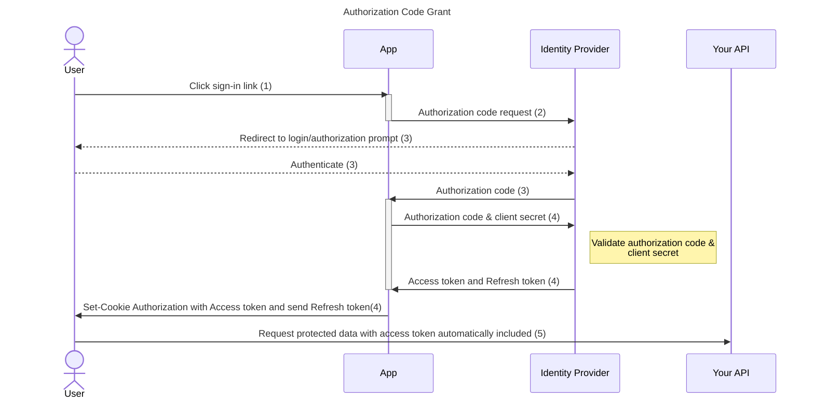
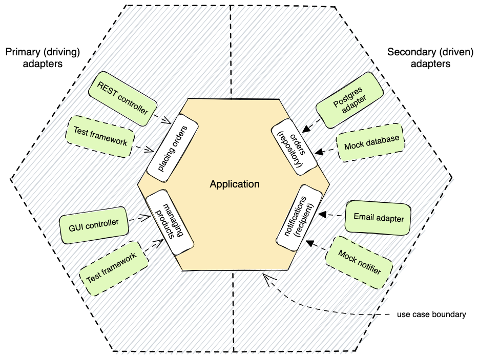

# Web frontend template
This template is meant to provide a base to develop new web apps. It showcases several architectures and useful features such as:
- 🔐 OAuth2 OpenID Connect Authentication
- 🌍 i18n
- 🛡️ Security standards
- 🧪 TDD
- 🏗️ Hexagonal architecture
- 📐 SOLID
- 🔧 Environment variables management
- ⚠️ Explicit error handling

## OpenID Connect Authentication
This pattern employ the commonly used OAuth2 protocol, implement the Authorization Code Grant (see https://datatracker.ietf.org/doc/html/rfc6749#section-4.1). It is secured because of the use of React Router server actions, which are doing the requests to the identity provider. Neither the access token nor the oauth secrets are exposed to the frontend.



The app exposes endpoints related to this authentication flow :

- `/oidc/callback` is the callback on which the authorization code is provided and the oauth2 state is checked.
- `/oidc/token` is the endpoint that the frontend calls with the authorization code. This endpoint will negotiate the access & refresh token with the identity provider. It will then set a secure cookie for the frontend, that will be used in every following request, containing the access token. It also answers with the refresh token and access token expiration time.
- `/oidc/refresh-token` will do the same thing but using the refresh and access token instead the authorization code.

## Internationalization with i18n
The translation of the app is done through the use of the `useTranslation` hook from https://github.com/i18next/react-i18next.

Translations are stored in public/locales/{lng}/{namespace}.json.

## Environment variables
Environment variables are loaded at runtime. They can be accessed by the `getClientEnv` and `getServerEnv` variables. The available variables can be set using [Arktype](https://arktype.io/) schema validation. 

Environment returned by `getClientEnv` will be exposed to the frontend and thus never contain any secret.

## Explicit Error Handling with neverthrow
This template uses [neverthrow](https://github.com/supermacro/neverthrow) for functional programming and explicit error handling. neverthrow provides a `Result<T, E>` type that forces developers to handle both success and error cases explicitly, eliminating runtime exceptions and making error handling more predictable.

### Key Benefits
- **No runtime exceptions**: All errors are handled explicitly through the Result type
- **Type safety**: TypeScript ensures all error cases are handled
- **Functional programming**: Promotes immutable data and pure functions
- **Predictable error handling**: Errors are part of the function signature

### Best Practices
- **Always handle both success and error cases** using `.match()`, `.map()`, or `.mapErr()`
- **Use descriptive error messages** that help with debugging
- **Chain operations** using `.andThen()` for sequential operations
- **Transform errors** using `.mapErr()` to provide context
- **Test both success and error paths** in your unit tests

## Hexagonal Architecture
__/src__ directory contains all the app.

Features sit in their __/src/{domain}__ dir. 



### Core (or Usecase)
The __core__ doesn't depend on anything besides model, and instead rely on dependency injection to get the needed dependencies. The __core__ is where the business logic happens. Decoupled from virtually anything, it is easily unit-testable by injecting fake dependencies. One __core__ per feature and a core per domain, that aggregate features cores.

Example :
```typescript
import type { UserStoreInterface } from "./user.store";
import type { UserRepository } from "./user.repository";
import { createQueryCurrentUserCore } from "./features/queryCurrentUser/queryCurrentUser.core";
import { createUpdateCurrentUserCore } from "./features/updateCurrentUser/updateCurrentUser.core";

export interface UserCoreArgs {
  userStore: UserStoreInterface;
  userRepository: UserRepository;
}
export const createUserCore = (args: UserCoreArgs) => {
  const updateCurrentUser = createUpdateCurrentUserCore(args);
  const queryCurrentUser = createQueryCurrentUserCore(args);

  return {
    queryCurrentUser,
    updateCurrentUser,
  };
};
```
Each feature core has a dedicated test file, unless the domain core is small enough to have a domain core test file.


### Store
The __store__ represent the internal, reactive, app state. It is injected in the core and exposes actions and observables. When a feature updates the internal app state, the associated core will use actions to manipulate the stored state.

Each domain has its own store. A feature can have its own store if the state management is complex enough.

### Repository
A repository is the persistent data access component. It can query and mutate data, usually by adding an abstraction layer over HTTP / GraphQL / gRPC / SQL / noSQL etc. In a frontend app, it's usually the component that lies between the core and the backend API.

Example
```typescript
import { type HTTPClient } from "src/shared/httpClient/httpClient";
import { CurrentUserSchema } from "./user.model";
import { UpdateCurrentUserInputSchema } from "./features/updateCurrentUser/updateCurrentUser.core";

export type UserRepository = ReturnType<typeof createUserRepository>;

export const createUserRepository = ({
  httpClient,
}: {
  httpClient: HTTPClient;
}) => {
  const queryCurrentUser = () => {
    return httpClient.get({
      url: "/api/user/current",
      responseType: CurrentUserSchema,
    });
  };

  const updateCurrentUser = (
    user: typeof UpdateCurrentUserInputSchema.infer
  ) => {
    return httpClient.post({
      url: "/api/user/current",
      body: user,
      responseType: CurrentUserSchema,
    });
  };

  return {
    queryCurrentUser,
    updateCurrentUser,
  };
};
```

### UI components
Features are usually linked to UI components. 