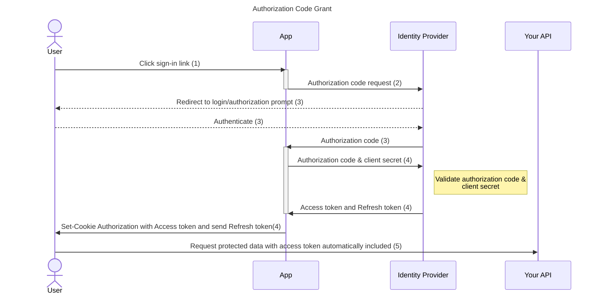

# Web frontend template
This template is meant to provide a base to develop new web apps. It showcases several architectures and useful features such as:
- 🔐 OAuth2 OpenID Connect Authentication
- 🌍 i18n
- 🛡️ Security standards
- 🧪 TDD
- 🏗️ Hexagonal architecture
- 📐 SOLID
- 🔧 Environment variables management

## OpenID Connect Authentication
This pattern employ the commonly used OAuth2 protocol, implement the Authorization Code Grant (see https://datatracker.ietf.org/doc/html/rfc6749#section-4.1). It is secured because of the use of React Router server actions, which are doing the requests to the identity provider. Neither the access token nor the oauth secrets are exposed to the frontend.

The app exposes endpoints related to this authentication flow :

- `/oidc/callback` is the callback on which the authorization code is provided and the oauth2 state is checked.
- `/oidc/token` is the endpoint that the frontend calls with the authorization code. This endpoint will negotiate the access & refresh token with the identity provider. It will then set a secure cookie for the frontend, that will be used in every following request, containing the access token. It also answers with the refresh token and access token expiration time.
- `/oidc/refresh-token` will do the same thing but using the refresh and access token instead the authorization code.

## Internationalization with i18n
The translation of the app is done through the use of the `useTranslation` hook from https://github.com/i18next/react-i18next.

Translations are stored in public/locales/{lng}/{namespace}.json.
